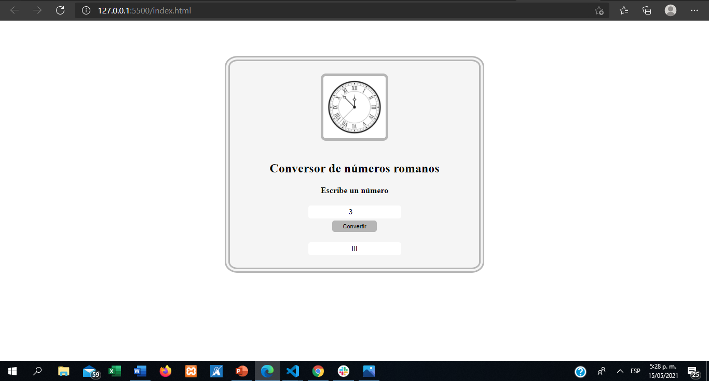
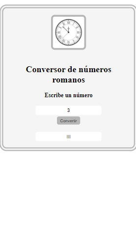

# 💎 Conversor Números Romanos

**Crea una nueva historia**&nbsp; &nbsp; &nbsp;&nbsp;

El algoritmo de transformar números a números romanos. Fue desarrollado por medio de una función que contiene bucle for y while. 

Puedes verlo aquí: https://jacksonguerrer0.github.io/Conversor_Numeros_Romanos/index.html

## Requerimientos

Requiere un navegador y que se abra el archivo index.html

## 🔥 Instalación

## 🔍 Vistas 

### 💻 Desktop

### 📱 Mobile

## 📌 Stack

<escribe aquí>

## 🌟 Autor

* **Jackson Guerrero**  - [@jacksonguerrer0](https://github.com/jacksonguerrer0)

